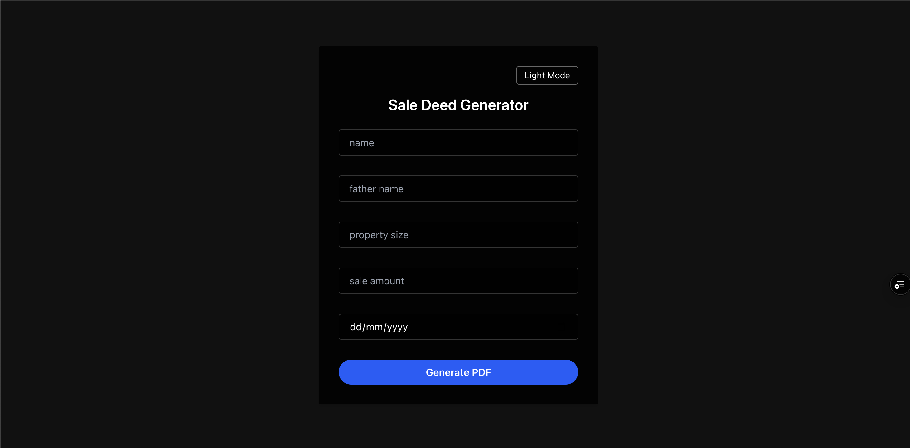

⸻


# 📄 SkyApex – Sale Deed PDF Generator

SkyApex is a modern web app that allows users to generate downloadable PDF Sale Deeds based on form input. It features a responsive UI with light/dark mode toggle and is optimized for serverless deployment (e.g., Vercel) using Puppeteer and a Chromium fallback.

---

## 🚀 Features

- 🧾 Sale Deed PDF generation from dynamic form input
- 🎨 Light & Dark mode support with toggle
- 💾 Instant PDF download
- ⚙️ Puppeteer-compatible serverless deployment
- 🛠 Built with modern technologies

---

## 🛠 Tech Stack

- Next.js 15 (App Router)
- TypeScript
- Tailwind CSS
- puppeteer-core
- @sparticuz/chromium
- Vercel (for deployment)

---

## 📂 Project Structure

.
├── app/
│   ├── page.tsx               # Home route with layout
│   └── pdf-generator/route.ts # API endpoint to generate PDF
├── components/
│   └── SaleDeedForm.tsx       # Form component with theme toggle
├── utils/
│   └── htmlTemplate.ts        # Generates dynamic HTML string
├── public/
│   └── favicon.ico
├── styles/
│   └── globals.css            # Global CSS variables for theming
└── README.md

---

## 💻 Setup & Installation

```bash
git clone https://github.com/your-username/skyapex.git
cd skyapex
npm install


⸻

🧪 Local Development

npm run dev

Visit: http://localhost:3000

⸻

☁️ Deployment on Vercel

To make Puppeteer work on Vercel, install these:

npm install puppeteer-core @sparticuz/chromium

In app/pdf-generator/route.ts, use this logic:

const browser = await puppeteer.launch({
  args: chromium.args,
  executablePath: process.env.VERCEL ? await chromium.executablePath() : undefined,
  headless: true,
});


⸻

📄 PDF Generation

PDFs are created server-side using Puppeteer and your custom HTML string. Files are automatically downloaded by the browser.

⸻

